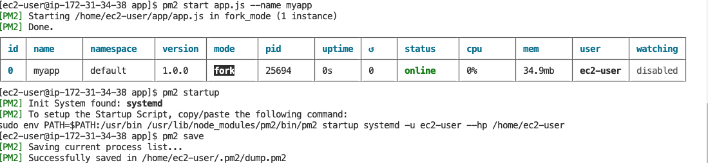
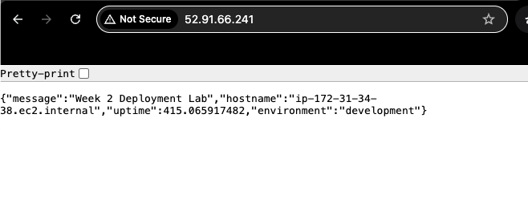
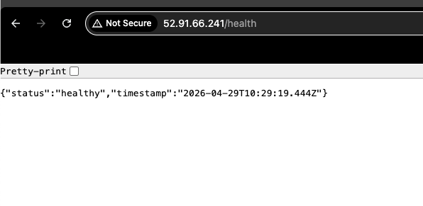

# Lab M2.07 - Deploy Node.js Application

**Name:** Mos
**Date:** 29.04.2026

Simple Express app deployed with PM2 and Nginx.

## Process
1. Install Node.js and npm.
2. Install `express` and create `app.js`.
3. Start the app with PM2:
   `pm2 start app.js --name myapp`
4. Configure Nginx to forward port `80` to `localhost:8080`.
5. Enable and start Nginx.

**Commands in**: [deployment-script.sh](deployment-script.sh)

## Test
- `GET /` returns app information.
- `GET /health` returns app health status.

## Screenshots

### PM2

### Root Endpoint

### Health Endpoint

